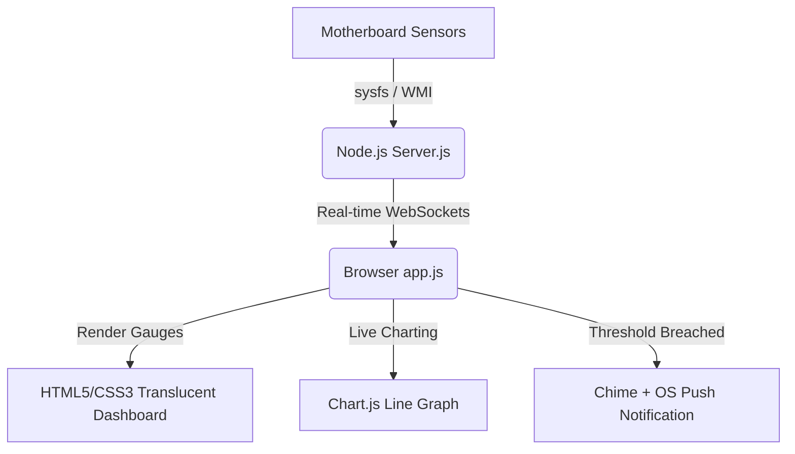

# 🌡️ AeroTherm - Cross-Platform Hardware Thermal Monitor

[](LICENSE)
[](https://github.com/TheShellMaster/thermal-monitor/stargazers)
[](https://nodejs.org)
[](#)

**AeroTherm** is a lightweight, high-performance, and beautifully designed hardware temperature monitoring application for Windows and Linux. Built with a premium **Glassmorphism dashboard**, AeroTherm tracks your system metrics in real-time, alerts you during thermal spikes, and offers proactive cooling tips.

> [!WARNING]
> Keep your hardware safe! High CPU temperatures can lead to thermal throttling, system instability, and reduced hardware lifespan. AeroTherm keeps you informed before it's too late.

---

## ✨ Features

* 📊 **Real-Time Dashboard**: Beautiful glassmorphic circular gauges for CPU Temperature, CPU Load, and RAM utilization.
* 📈 **Historical Charting**: High-resolution live line graphs tracking temperature records over the last 60 seconds.
* 🔔 **Dual Notification Alerts**: Instantly triggers both a flashing visual warning banner and a synthesizer beep alarm (via Web Audio API) when safe temperatures are exceeded.
* 🖥️ **Hardware Detection**: Auto-detects operating system version, CPU manufacturer & brand, active logical cores, total memory, GPU controller model, and battery capacity.
* ⚙️ **Custom Configuration**: Easily change alert thresholds (from 40°C to 95°C) and toggle sound/desktop alerts directly in the UI (settings are stored locally in the browser).
* 🐧🪟 **Cross-Platform**: Simple startup scripts (`.sh` for Linux and `.bat` for Windows) with automatic dependency checks.

---

## 🚀 Getting Started

### Prerequisites
Make sure you have **Node.js** (v18.0.0 or higher) installed on your system.

* **Windows**: Download the installer from [nodejs.org](https://nodejs.org/).
* **Linux (Ubuntu/Debian)**: 
  ```bash
  sudo apt update && sudo apt install nodejs npm -y
  ```

---

## 🏃‍♂️ How to Run

Clone the repository and launch the app using the direct platform scripts:

### Linux
```bash
# Clone the repository
git clone https://github.com/TheShellMaster/thermal-monitor.git
cd thermal-monitor

# Make the launcher script executable and run it
chmod +x start.sh
./start.sh
```

### Windows
1. Download the repository as a ZIP or clone it:
   ```cmd
   git clone https://github.com/TheShellMaster/thermal-monitor.git
   cd thermal-monitor
   ```
2. Double-click **`start.bat`** (or execute it in Command Prompt).

*The application will automatically verify dependencies, start the background monitor server on port `3000`, and open [http://localhost:3000](http://localhost:3000) in your default browser.*

---

## 🔧 Under the Hood & Architecture

AeroTherm uses a client-server architecture to ensure high performance without lagging your system:



### Fallback Driver (Linux)
On minimal or containerized Linux environments where high-level sensor bindings fail, AeroTherm contains an intelligent fallback mechanism that reads temperatures directly from raw kernel sysfs devices (`/sys/class/thermal/thermal_zone*/temp`).

---

## 💡 Proactive Thermal Tips
If your computer is consistently running hot:
1. **Airflow**: Always keep your laptop or desktop on a hard, flat surface. Blankets and beds block intake grills.
2. **Close Heavy Tasks**: Use system monitors to terminate runaway processes using high CPU percentages.
3. **Hardware Clean**: Clean dust buildup from heatsinks and fans, and re-apply high-quality thermal paste to the CPU/GPU if the machine is older than 2 years.

---

## 🏷️ GitHub Search Keywords / Topics
To help users discover this repository, add the following topics on your GitHub repository settings page:
`cpu-temperature` • `hardware-monitor` • `thermal-alert` • `temperature-monitor` • `glassmorphism` • `linux-temperature` • `windows-temperature` • `realtime-dashboard` • `socket-io` • `node-hardware-info` • `cpu-monitoring`

---

## 📄 License
This project is licensed under the MIT License. Feel free to use, modify, and distribute it.
