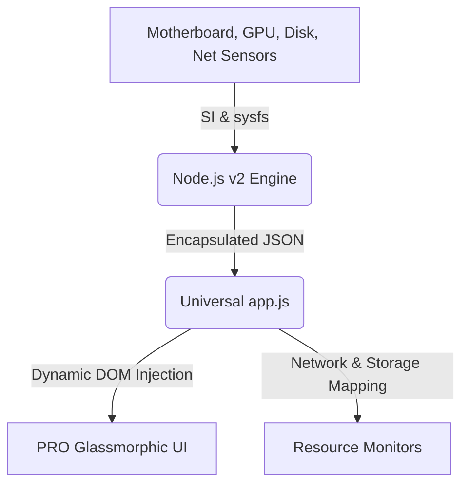

# 🌡️ AeroTherm - Cross-Platform Hardware Thermal Monitor (v2.0)

[](LICENSE)
[](https://github.com/TheShellMaster/thermal-monitor/stargazers)
[](https://nodejs.org)
[](#)

**AeroTherm v2.0** is a professional-grade, high-performance, and beautifully designed hardware monitoring dashboard. It doesn't just monitor your CPU; it adapts dynamically to any hardware configuration to track everything that generates heat and consumes resources in your machine.

> [!IMPORTANT]
> **Version 2.0 (Pro)**: This update introduces universal component detection, multi-GPU monitoring, and real-time network/storage analysis.

---

## ✨ Features (v2.0 PRO)

* 🚀 **Universal Component Detection**: Automatically detects and adapts to your specific hardware. If you have 2 GPUs and 5 Hard Drives, AeroTherm shows them all.
* 🎮 **Professional Multi-GPU Monitoring**: Tracks utilization and temperature for all detected graphics cards (Nvidia, AMD, Intel).
* 💽 **Dynamic Storage Dashboard**: Live tracking of all mounted drives/partitions with real-time usage percentages and capacity analysis.
* 🌐 **Live Network Streams**: Monitor your real-time Download and Upload speeds directly on the dashboard.
* 🌡️ **Full Thermal Sensor Grid**: Accesses every available thermal sensor, including individual CPU cores and motherboard chipsets.
* 📊 **Enhanced Glassmorphism UI**: Refined design with smoother animations, improved gauging system, and responsive layout for all screen sizes.
* 📈 **Historical Charting**: High-resolution live line graphs tracking temperature records.
* 🔔 **Smart Alerts**: Instantly triggers visual warnings, synthesizer beep alarms, and OS-level notifications when thresholds are breached.

---

## 🚀 Getting Started

### Prerequisites
Make sure you have **Node.js** (v18.0.0 or higher) installed on your system.

* **Windows**: Download the installer from [nodejs.org](https://nodejs.org/).
* **Linux (Ubuntu/Debian)**: 
  ```bash
  sudo apt update && sudo apt install nodejs npm -y
  ```

---

## 🏃‍♂️ How to Run

### Linux
```bash
chmod +x start.sh
./start.sh
```

### Windows
Double-click **`start.bat`** (or execute it in Command Prompt).

*The application will automatically verify dependencies, start the background monitor server on port `3000`, and open [http://localhost:3000](http://localhost:3000).*

---

## 🔧 Under the Hood & Architecture

AeroTherm 2.0 uses an advanced data polling engine:



### Fallback Driver (Linux)
AeroTherm v2.0 features an enhanced intelligent fallback for Linux, scanning `/sys/class/thermal/` to find deep-level sensors that standard libraries might miss.

---

## 📄 License
This project is licensed under the MIT License. Fait avec amour pour la sécurité de votre matériel.
